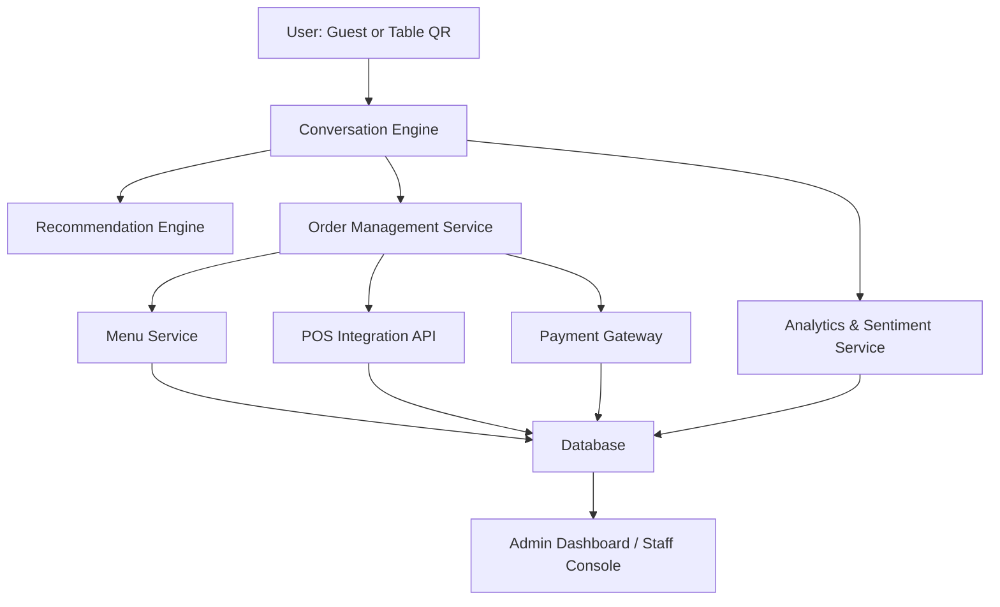
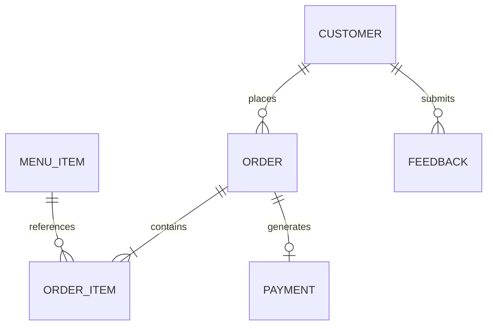

# 🍽️ AI Waiter / Waitress System – Functional Requirements Document (FRD)

## 1. System Overview
This document expands on the business requirements and specifies the functional, data, and architectural design for the **AI Waiter / Waitress Application**. The system enables customers to interact naturally with a conversational AI to explore menus, place orders, and complete payments.

---

## 2. System Architecture

### 2.1 Overview
The system follows a modular, service-oriented design with the following layers:

- **Presentation Layer**: Front-end interfaces (tablet, kiosk, mobile web).
- **Conversation Layer**: Natural Language Processing (LLM-based AI) managing dialogue context.
- **Application Logic Layer**: Orchestrates ordering, recommendations, and payment flows.
- **Integration Layer**: Interfaces with external systems (POS, CRM, payment gateways).
- **Data Layer**: Centralized data store for menu, orders, analytics, and logs.

### 2.2 Architecture Diagram (Conceptual)

---

## 3. Functional Modules

### 3.1 Conversational Engine
**Description:** Core AI model capable of understanding, managing, and generating conversational responses.

**Functions:**
- Natural language understanding for food-related dialogue.
- State management (track ongoing orders, diners, preferences).
- Voice and text mode support.
- Multilingual support (EN, FR, ES, others).
- Integrate tone/sentiment detection to adapt responses.

### 3.2 Menu Management
- Load menu dynamically from POS or internal CMS.
- Allow tagging (vegan, spicy, gluten-free, chef’s special).
- Include rich media (images, descriptions, videos).
- Auto-update for item availability and price changes.
- Provide nutrition and allergen info.

### 3.3 Recommendations Engine
- Contextual upselling (“Would you like to pair that with a Malbec?”).
- Use ML-based collaborative filtering or rule-based logic.
- Factor in preferences, popularity, and time of day.
- Dynamic promotions (e.g., “2-for-1 desserts until 8 PM”).

### 3.4 Order Management
- Capture and validate orders conversationally.
- Handle modifiers (extra cheese, no onions).
- Split orders per diner or course.
- Real-time status tracking (“Your food is being prepared.”).
- Sync directly with kitchen display systems.

### 3.5 Payment Processing
- Support multiple payment methods: credit, debit, Apple Pay, Google Pay, QR pay.
- Split bill functionality.
- Secure card tokenization and PCI compliance.
- Generate digital or printed receipts.

### 3.6 Feedback & Analytics
- Post-meal surveys and sentiment collection.
- Staff dashboard for live monitoring.
- Analytics dashboard: top items, upsell success, dwell time, satisfaction trends.

---

## 4. Data Model (Simplified ERD)

---

## 5. External Integrations

| Integration | Purpose | Example Vendors |
|--------------|----------|----------------|
| POS Systems | Order submission, menu sync | Toast, Square, Lightspeed |
| Payment Gateway | Process transactions | Stripe, Adyen, Clover |
| CRM / Loyalty | Track visits, rewards | Punchh, Zoho, Salesforce |
| Analytics | Visualize KPIs | Looker, Power BI, Datadog |

---

## 6. Security & Compliance
- **Authentication**: OAuth 2.0 for admin dashboard and APIs.
- **Encryption**: TLS 1.3 for all traffic, AES-256 for stored data.
- **PCI DSS Compliance**: All payment data handled via secure third-party gateways.
- **Privacy**: Voice and text data anonymized and retained per GDPR/CCPA.

---

## 7. Performance & Scalability
- Sub-second conversational response (<1.5s goal).
- Auto-scaling containers via Kubernetes.
- Message queue (Kafka) for asynchronous order handling.
- Load balancing for high traffic restaurants.

---

## 8. Monitoring & Maintenance
- Real-time monitoring (Prometheus + Grafana).
- Error and latency alerts.
- Nightly data backups and weekly retraining (for AI model tuning).
- Versioned deployment via CI/CD (GitHub Actions or Azure DevOps).

---

## 9. Future Enhancements
- AR food visualization.
- Voice biometrics for returning guests.
- Predictive ordering based on historical dining patterns.
- Table-to-kitchen conversational confirmation (“Chef acknowledged your order!”).
