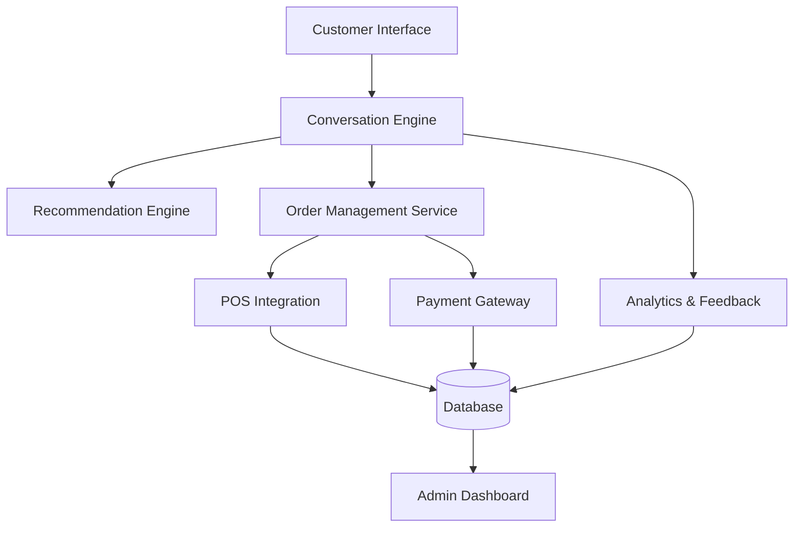
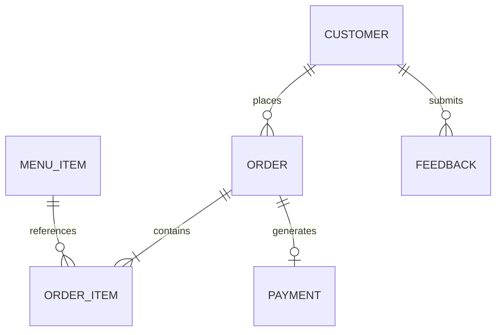

# 🤖 Ai-mi – Product Requirements Document (PRD)

## Overview
**Ai-mi** is an AI-driven virtual waiter/waitress designed to enhance the dining experience by offering natural, conversational interactions with guests. Ai-mi can greet customers, describe dishes, make personalized recommendations, take orders, and process payments, all while integrating with restaurant POS and CRM systems.

This PRD consolidates the **Business Requirements** and **Functional Requirements** into a unified framework for development and investor presentation.

---

## 1. Business Overview
**Ai-mi** transforms traditional restaurant menus into dynamic, conversational dining companions. By replacing static menus and routine staff interactions with AI-powered service, Ai-mi helps restaurants deliver faster, friendlier, and more personalized experiences — improving both guest satisfaction and operational efficiency.

---

## 2. Business Objectives
- Create an **intuitive AI service** that mirrors a human waiter’s attentiveness.
- Reduce **front-of-house staffing costs** while maintaining service excellence.
- Use **AI-driven recommendations** to boost average order value.
- Enable **instant POS and payment integration** for frictionless checkout.
- Deliver **data insights** for restaurant managers and owners.

---

## 3. Core Capabilities

### 3.1 Guest Interaction
- Natural language conversation (voice or text).
- Recognition of allergies, dietary preferences, and prior visits.
- Menu exploration with detailed item descriptions.
- Personalized recommendations and promotions.

### 3.2 Ordering
- Conversational order taking and confirmation.
- Multi-guest or group ordering.
- Menu customization and modifications (e.g., “no onions,” “extra cheese”).
- Integration with kitchen systems for real-time updates.

### 3.3 Payment
- Bill presentation (itemized or grouped).
- Supports credit/debit cards, QR, Apple Pay, Google Pay, and cash.
- Handles split payments and tipping.
- Sends digital receipts and loyalty rewards.

### 3.4 Feedback & Analytics
- Post-meal satisfaction prompts.
- Real-time dashboards for restaurant analytics.
- Reporting on top items, customer sentiment, and conversion trends.

---

## 4. Target Users

| User | Purpose | Interaction |
|-------|----------|--------------|
| **Customers** | Explore, order, pay | Voice/Text chat |
| **Waitstaff / Managers** | Monitor, override, manage tables | Dashboard |
| **Owners / Admins** | Configure menus, view analytics | Admin Console |
| **System Integrators** | Maintain APIs, connect POS | Technical Interfaces |

---

## 5. Functional Requirements

### 5.1 Conversational Engine
- Natural language understanding for menu and order interactions.
- Emotional tone detection to adjust responses.
- Context persistence throughout a dining session.
- Multilingual capabilities.

### 5.2 Menu Management
- Sync menu from POS or CMS.
- Include descriptions, tags, allergens, nutrition info, and availability.
- Auto-update prices and stock in real-time.

### 5.3 Recommendations Engine
- Suggest complementary dishes or drinks.
- Personalize recommendations using historical data.
- Dynamic promotions based on time or popularity.

### 5.4 Order Management
- Validate and confirm orders conversationally.
- Track multi-diner sessions.
- Push orders to the kitchen system instantly.

### 5.5 Payment Processing
- Process transactions securely.
- Comply with PCI DSS standards.
- Handle partial/split bills and tips.
- Provide digital receipts and loyalty integration.

### 5.6 Analytics & Insights
- Track guest satisfaction, sentiment, and average order values.
- Display operational metrics (order times, popular items).
- Export data to BI tools (Power BI, Looker).

---

## 6. System Architecture

### Layers
- **Presentation Layer:** Tablet, mobile, or kiosk UI.
- **Conversation Layer:** AI model for dialogue management.
- **Application Logic:** Orchestrates interactions, order flow, and payment.
- **Integration Layer:** Connects POS, CRM, and payment APIs.
- **Data Layer:** Central data store for menu, order, and analytics data.

---

## 7. Data Model (Simplified)

---

## 8. Non-Functional Requirements
| Category | Description |
|-----------|--------------|
| **Performance** | Sub-1.5s conversational latency |
| **Scalability** | Supports 100+ concurrent tables |
| **Security** | PCI DSS, GDPR, CCPA compliant |
| **Reliability** | 99.9% uptime |
| **Accessibility** | Voice and text enabled, multilingual |
| **Maintainability** | Modular microservice architecture |

---

## 9. Integrations

| Type | Purpose | Examples |
|------|----------|-----------|
| **POS** | Orders, menu sync | Toast, Square, Lightspeed |
| **Payments** | Transactions | Stripe, Adyen, Clover |
| **CRM / Loyalty** | Customer tracking | Punchh, Zoho CRM |
| **Analytics** | Reporting & visualization | Power BI, Looker |

---

## 10. Security & Compliance
- OAuth 2.0 for admin access.
- TLS 1.3 and AES-256 encryption.
- All payment data handled by secure third-party gateways.
- Voice/text data anonymized per GDPR.

---

## 11. KPIs & Success Metrics
- 20% increase in upsells.
- 30% faster order-to-kitchen times.
- 90%+ satisfaction scores.
- 10% reduction in staff overhead.
- 99% order accuracy.

---

## 12. Brand Identity
| Attribute | Description |
|------------|--------------|
| **Name** | Ai-mi (AI + ami = “friend”) |
| **Tagline** | “Smart Service with a Human Touch.” |
| **Tone** | Warm, conversational, friendly |
| **Logo** | Rounded sans-serif, minimalist |
| **Color Palette** | Soft neutrals + elegant tech accents |

---

## 13. Implementation Roadmap

| Phase | Timeline | Deliverables |
|--------|-----------|---------------|
| **Phase 1** | Month 1–2 | MVP (text chat + POS mock) |
| **Phase 2** | Month 3–4 | Voice + payment integrations |
| **Phase 3** | Month 5–6 | Analytics dashboard + loyalty features |
| **Phase 4** | Month 7+ | Pilot rollout with real restaurants |

---

**Prepared for:** Ai-mi Project Stakeholders  
**Author:** GPT-5 (Business Systems Analyst)  
**Date:** October 2025
